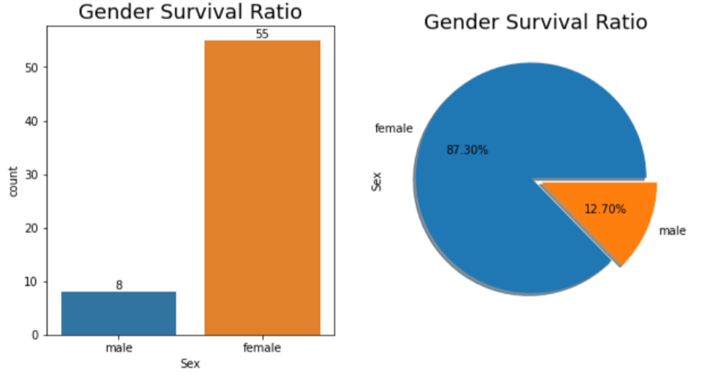
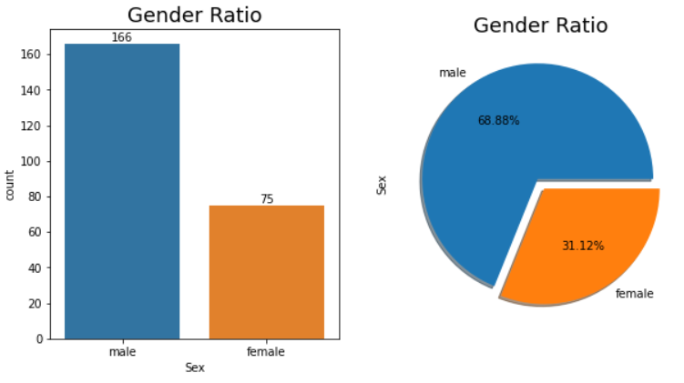

# Machine Learning Regression and Classification

> Welcome to the implementation of Regression and Classification...
>
> Please find attached the datasets in the respective folders.

<h3>Disclaimer</h3>

This project has been designed and developed under the machine learning module.
This piece of work remains as a submitted coursework designed by the author and hence should not be copied as an original work for other fields, including but not limited to the academics.
Please feel free to contact the author should you have any queries about the accuracy or any other details.

<h3>Introduction</h3>

With the help of supervised learning, this experiment will attempt to implement machine learning models for regression and classification tasks. The chosen models for regression are Linear, Lasso, and Ridge. Whereas, for classification, Logistic regression and SVM are chosen. The results reflect that the ridge and logistic regression are the main (outperforming) models for regression and classification tasks respectively. The selection of the baseline and the main model is strictly based on the evaluation of the results derived from the analysis of the metrics. Furthermore, the evaluation is supported with visualisation to better understand the working and the underlying concept of the achieved results.

<h3>Experiment results</h3>
<h4>Regression results</h4>

  
  
    

<h3 align="center">Degree Analysis using R2 Score</h3>

  
  

<h3 align="center">Alpha Analysis using R2 Score</h3>

<h4>Classification results</h4>

  
  
  

<h3 align="center">Analysis of parameters for logistic regression</h3>

  
  

<h3 align="center">Gender analysis on testing data using logistic regression</h3>

<h3>Conclusion</h3>

As the model accuracy/score inherently depends on the features utilised, feature engineering or correlation analysis could be an alternative to enhance model performance. Techniques such as cross-validation could be incorporated to further enhance and prevent overfitting. The tuning of the hyperparameters could have produced different results with different range numbers which could have led to different results, as it’s practically impossible to encompass the entire range to inspect for the best magnitude. But the achieved results could be assumed to be nearer to the theoretical best. Various other regression models (decision tree or KNN) and classification models (neural network) with varied hyperparameter tunings could be tested to improve the results further.

<h3>Citations</h3>

1. https://ai-master.gitbooks.io/logistic-regression/content/sigmoid-function.html
2. https://www.datacamp.com/tutorial/tutorial-lasso-ridge-regression
